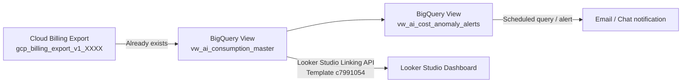

# Google Cloud AI Consumption & Cost Dashboard

A turnkey toolkit that transforms your **Google Cloud Billing Export (BigQuery)** into a curated **AI / GenAI consumption and cost dashboard** in Looker Studio.

---

## Table of Contents

1. [Objective](#1-objective)
2. [High-Level Architecture](#2-high-level-architecture)
3. [Implementation & Guides](#3-implementation--guides)
4. [Frequently Asked Questions (FAQ)](#4-frequently-asked-questions-faq)

---

## 1. Objective

Google Cloud's standard billing export contains every SKU across every service, making it difficult to answer AI-specific questions such as:

- *How much are we spending on Gemini vs. Claude vs. Imagen?*
- *What is our input (prompt) vs. output (response) token cost ratio?*
- *Which team or project is driving GPU / TPU spend?*
- *Did any project's AI spend spike unexpectedly yesterday?*

This toolkit solves that by deploying a **single, curated BigQuery view** (`vw_ai_consumption_master`) on top of your billing export (or sample demo data) that provides:

| Capability | Description |
| :--- | :--- |
| **AI-only filtering** | Isolates Vertex AI, Generative AI, Conversational AI, Document/Vision/Speech AI, and GPU/TPU compute SKUs from all other cloud spend. |
| **Category classification** | Buckets spend into `Generative AI`, `Agentic & Conversational AI`, `AI Compute (GPU/TPU)`, `Vector Search & Embeddings Infra`, `Enterprise AI Subscriptions (Seats)`, and `Perception & Cognitive AI`. |
| **Model-family parsing** | Extracts model families from SKU descriptions (Gemini 1.5 Pro/Flash, Gemini 2.0, Gemini 2.5/3.5, Anthropic Claude, Imagen, Embeddings, Vector Search, Gemini Code Assist, A100 / H100 / L4 GPUs, TPUs). |
| **Token modality** | Splits GenAI SKUs into `Input (Prompt)`, `Output (Response)`, `Output (Thinking / Reasoning)`, `Context Cache`, and `Subscription / Seat`. |
| **True net cost** | Computes `net_cost = gross_cost + credits` (credits are negative in the export) so CUDs, SUDs, and promotions are reflected. |
| **Chargeback labels** | Surfaces `team`, `environment`, `cost_center`, and `app` labels for showback / chargeback. |
| **Anomaly detection** | A companion view (`vw_ai_cost_anomaly_alerts`) flags any project whose daily AI spend exceeds 1.8× its 7-day rolling average. |

The result is a Looker Studio-ready data source that requires **no custom SQL in the BI layer**.

---

## 2. High-Level Architecture

> [!NOTE]
> The toolkit **never modifies or copies** your billing export table. Both deployed objects are *views*, so they always reflect the latest exported data and add no storage cost.

---

## 3. Implementation & Guides

All implementation steps, deployment options, schema documentation, and troubleshooting guides have been consolidated into dedicated documents:

👉 **[Complete Implementation & Deployment Guide](demo_and_production_guide.md)**
- **Step-by-step Demo Deployment**: Generate 60 days of realistic dummy AI billing data with 1 command.
- **Production Deployment**: Connect to your live Google Cloud Billing export table in BigQuery.
- **Zero-Downtime Transition**: Switch from demo data to production export without reconnecting or editing Looker Studio reports.
- **Looker Studio Setup**: 1-click template cloning via Linking API (`c7991054-d499-4aa0-9b2a-e8f98d92ea55`).
- **Master View Schema Reference**: Full column catalog and data types.
- **Customizations**: Label keys, service lists, regex model parsing, and anomaly sensitivity.
- **Troubleshooting**: Solutions for common BigQuery, IAM, and visualization issues.

### Toolkit Files Reference

| File | Purpose |
| :--- | :--- |
| **[`demo_and_production_guide.md`](demo_and_production_guide.md)** | End-to-end implementation guide (dummy data setup, production export switch, schema reference, and troubleshooting). |
| **[`deploy_ai_dashboard.sh`](deploy_ai_dashboard.sh)** | Automated Bash deployment script for creating datasets, sample data, and BigQuery views. |
| **[`create_looker_studio_dashboard.py`](create_looker_studio_dashboard.py)** | Generates a 1-click Looker Studio Linking API URL that clones the dashboard template and maps it to your BigQuery view. |
| **[`gcp_ai_consumption_dashboard_guide.md`](gcp_ai_consumption_dashboard_guide.md)** | Chart-by-chart Looker Studio visualization reference. |

---

## 4. Frequently Asked Questions (FAQ)

**Does the deployment script create dummy data?**
Only if you choose **Demo mode (option 2)**. In **Production mode (option 1)**, the script creates views directly over your existing billing export table without copying or generating any data.

**Will this affect my billing export or incur storage costs?**
No. Only SQL views are created; no data is duplicated. Query costs in BigQuery only occur when the Looker Studio dashboard queries the view, proportional to the partitions scanned.

**Can I start with dummy data and switch to my real billing export later?**
Yes! Because Looker Studio connects to the BigQuery view (`vw_ai_consumption_master`), you can update the view to point to your live export table at any time. Your Looker Studio dashboard will immediately update without any reconfiguration. See [demo_and_production_guide.md](demo_and_production_guide.md) for instructions.

**Can I point the view at multiple billing accounts?**
Yes. You can update the view's `FROM` clause with a `UNION ALL` across multiple export tables or use a wildcard table if they reside in the same dataset.

**Does it work with the FOCUS export?**
Not out-of-the-box, as the FOCUS schema uses different column names (`BilledCost`, `ServiceName`, `ChargeCategory`, etc.). The classification and regex logic is portable, but the `SELECT` list must be remapped to FOCUS column names.

**How current is the data?**
Standard Google Cloud Billing export latency is typically a few hours. The dashboard reflects whatever data has landed in BigQuery at query time.
