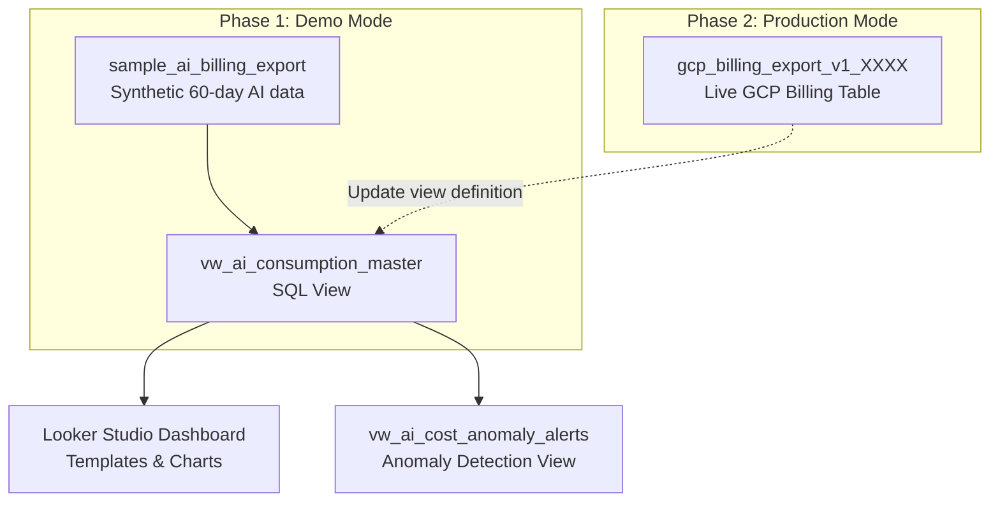

# Implementation & Deployment Guide: Google Cloud AI Consumption Dashboard

Deploy the AI Consumption Dashboard with realistic **dummy (sample) data** for immediate sandbox testing, or connect directly to your live **Google Cloud Billing Export** in BigQuery.

---

## Table of Contents

1. [Architecture & Core Concepts](#1-architecture--core-concepts)
2. [How the Automated Deployment Script Works](#2-how-the-automated-deployment-script-works)
3. [Prerequisites & Access Checklist](#3-prerequisites--access-checklist)
4. [Deploy with Dummy Data (Demo Mode)](#4-deploy-with-dummy-data-demo-mode)
5. [Deploy / Switch to Live Billing Export (Production Mode)](#5-deploy--switch-to-live-billing-export-production-mode)
6. [Master View Schema Reference](#6-master-view-schema-reference)
7. [Building & Configuring the Looker Studio Dashboard](#7-building--configuring-the-looker-studio-dashboard)
8. [Access Management & Permissions](#8-access-management--permissions)
9. [Customization Guide](#9-customization-guide)
10. [Troubleshooting](#10-troubleshooting)

---

## 1. Architecture & Core Concepts

Looker Studio connects to a curated BigQuery view: **`vw_ai_consumption_master`**, never directly to raw tables.



> [!NOTE]
> Because Looker Studio reads from the **view**, your dashboard charts, fields, metrics, and URLs remain completely intact when you transition from dummy data to production. You only update the underlying view definition in BigQuery. The toolkit **never modifies or copies** your billing export table.

---

## 2. How the Automated Deployment Script Works

`deploy_ai_dashboard.sh` is an interactive Bash script that wraps the `gcloud` and `bq` CLIs. It executes the following stages:

### Step 0 — Pre-flight checks
- Verifies `gcloud` and `bq` are installed and on `PATH`.
- Reads the current `gcloud` project and prompts you to confirm or override it.

### Step 1 — Dataset provisioning
- Prompts for a **target dataset ID** (default: `ai_billing_dashboard`) and **location** (default: `US`).
- Runs `bq mk --dataset` only if the dataset does not already exist (idempotent).

> [!IMPORTANT]
> The target dataset **must be in the same location** as your billing export dataset (typically `US` or `EU`). BigQuery views cannot reference tables across locations.

### Step 2 — Data source selection
The script offers two modes:

| Mode | When to use | What happens |
| :--- | :--- | :--- |
| **1 – Production** | You have an existing billing export table. | You are prompted for the fully-qualified table path. **No data is generated or copied.** |
| **2 – Demo** | Sandbox / Argolis project with no billing export. | Creates `sample_ai_billing_export` with 60 days of synthetic, schema-compatible data. |

### Step 3 — Deploy `vw_ai_consumption_master`
Executes a `CREATE OR REPLACE VIEW` statement that:
1. Filters the source table to AI services and GPU/TPU compute SKUs.
2. Flattens the `credits` array into `total_credits` and computes `net_cost`.
3. Unnests the `labels` array into `label_env`, `label_team`, `label_cost_center`, `label_app`.
4. Adds derived classification columns: `ai_category`, `model_or_resource_family`, and `modality_type` via `REGEXP_CONTAINS` on `sku.description`.

### Step 4 — Deploy `vw_ai_cost_anomaly_alerts`
Creates a companion view that aggregates daily net cost per project / category, computes a trailing 7-day rolling average with a window function, and returns only rows where today's spend is `> $50` **and** `> 1.8×` the baseline.

### Step 5 — Summary
Prints the fully-qualified names of the deployed views and connection instructions.

---

## 3. Prerequisites & Access Checklist

| Requirement | Details |
| :--- | :--- |
| **Local / Cloud tooling** | `gcloud` CLI with `bq` installed (`gcloud components install bq`), authenticated via `gcloud auth login` or active in Cloud Shell. |
| **IAM on Target Project** | `roles/bigquery.dataEditor` (create datasets & views) and `roles/bigquery.jobUser` (run queries). |
| **IAM on Billing Export (Production only)** | `roles/bigquery.dataViewer` (read the export table). |
| **Looker Studio Access** | Access to [lookerstudio.google.com](https://lookerstudio.google.com) with BigQuery Read access. |

---

## 4. Deploy with Dummy Data (Demo Mode)

Follow this section to test the complete dashboard experience immediately using realistic synthetic data.

### 4.1 Run the Deployment Script

In Cloud Shell or your terminal:

```bash
chmod +x deploy_ai_dashboard.sh
./deploy_ai_dashboard.sh
```

### 4.2 Answer the Prompts for Demo Mode

| Prompt | Input | Description |
| :--- | :--- | :--- |
| `Enter your Argolis Project ID` | Press **Enter** | Uses your active `gcloud` project ID. |
| `Enter BigQuery Dataset ID` | Press **Enter** | Uses default: `ai_billing_dashboard`. |
| `Enter BigQuery Dataset Location` | Press **Enter** | Uses default: `US` (or type your region, e.g. `EU`). |
| `Select option [1 or 2]` | **`2`** | Selects **Demo mode**. |

### 4.3 What Gets Created
1. **Dataset**: `ai_billing_dashboard` (if not already existing).
2. **Table `sample_ai_billing_export`**: 60 days of synthetic billing items with realistic pricing, discounts, and units:
   - **Generative AI & Reasoning Tokens**: Gemini 1.5 Pro/Flash, Gemini 2.0 Flash, Gemini 2.5 Pro/Flash (with Thinking/Reasoning output tokens), Gemini 3.5 Flash, Claude 3.5 Sonnet, Imagen 3, Multimodal Embeddings.
   - **Vector Search & Infrastructure**: Vector Search index serving (e2-standard-16).
   - **Enterprise AI Subscriptions**: Duet AI: Gemini Code Assist seat licenses, Vertex AI Search: Gemini Enterprise Standard 1-Yr subscriptions.
   - **AI Compute**: NVIDIA A100 80GB, H100, L4 GPUs, and Cloud TPU v5e pod slices.
   - **Agentic & Perception AI**: Document AI, Dialogflow CX, Discovery Engine / Vertex Search.
   - **Labels**: Realistic `environment` (`prod`, `staging`, `dev`), `team`, `cost_center`, and `app`.
3. **Master View**: `vw_ai_consumption_master` (normalizes credits and maps AI categories).
4. **Anomaly View**: `vw_ai_cost_anomaly_alerts`.

### 4.4 Verify Dummy Data in BigQuery

Run this sanity query in Cloud Shell:

```bash
bq query --use_legacy_sql=false "
SELECT
  ai_category,
  model_or_resource_family,
  ROUND(SUM(gross_cost), 2) AS gross_usd,
  ROUND(SUM(total_credits), 2) AS credits_usd,
  ROUND(SUM(net_cost), 2) AS net_usd
FROM \`ai_billing_dashboard.vw_ai_consumption_master\`
GROUP BY 1, 2
ORDER BY net_usd DESC;"
```

### 4.5 Launch the Looker Studio Dashboard

Run the included Python cloner:

```bash
python3 create_looker_studio_dashboard.py <PROJECT_ID> ai_billing_dashboard vw_ai_consumption_master
```

1. Open the generated URL in your browser.
2. Looker Studio clones template `c7991054-d499-4aa0-9b2a-e8f98d92ea55` and maps it to your BigQuery view.
3. Click **Save and share** to preserve your copy.

---

## 5. Deploy / Switch to Live Billing Export (Production Mode)

Follow this section when you are ready to point the dashboard to your real Google Cloud Billing Export.

### 5.1 Locate Your Billing Export Table

In the BigQuery console or via CLI:

```bash
# List datasets in billing project
bq ls --project_id=<BILLING_PROJECT_ID>

# List tables in billing dataset
bq ls <BILLING_PROJECT_ID>:<BILLING_DATASET_ID>
```

Identify the fully-qualified table path:
```
<BILLING_PROJECT_ID>.<BILLING_DATASET_ID>.gcp_billing_export_v1_XXXXXX_XXXXXX_XXXXXX
```
*(Or `gcp_billing_export_resource_v1_XXXXXX_XXXXXX_XXXXXX` if using Detailed Export).*

Confirm the dataset location:
```bash
bq show --format=prettyjson <BILLING_PROJECT_ID>:<BILLING_DATASET_ID> | grep location
```

> [!IMPORTANT]
> The target dataset containing your views **must be in the same location** (`US`, `EU`, or region) as your billing export dataset.

### 5.2 (Optional) Pre-Flight Check: Verify AI Spend in Export

Run this query against your raw billing export table to confirm AI line items exist:

```sql
SELECT
  service.description AS service_name,
  COUNT(1)            AS line_items,
  ROUND(SUM(cost), 2) AS gross_cost
FROM `<BILLING_PROJECT_ID>.<BILLING_DATASET_ID>.gcp_billing_export_v1_XXXXXX_XXXXXX_XXXXXX`
WHERE _PARTITIONDATE >= DATE_SUB(CURRENT_DATE(), INTERVAL 30 DAY)
  AND (
    service.description IN ('Vertex AI', 'Document AI', 'Discovery Engine', 'Dialogflow CX',
                            'Cloud Vision API', 'Cloud Translation API', 'Cloud Speech-to-Text API')
    OR (service.description = 'Compute Engine'
        AND REGEXP_CONTAINS(sku.description, r'(?i)Nvidia|A100|H100|L4|T4|TPU'))
  )
GROUP BY 1
ORDER BY gross_cost DESC;
```

### 5.3 Method A: Automated Switch via Script (Recommended)

Re-run `deploy_ai_dashboard.sh`:

```bash
./deploy_ai_dashboard.sh
```

| Prompt | Value |
| :--- | :--- |
| `Enter your Argolis Project ID` | Target project where views will live. |
| `Enter BigQuery Dataset ID` | `ai_billing_dashboard` (or your existing billing dataset). |
| `Enter BigQuery Dataset Location` | **Must match** billing export dataset location (e.g. `US`). |
| `Select option [1 or 2]` | **`1`** (Production mode) |
| `Enter full path to Billing Export table` | Full table path from §5.1. |

The script executes `CREATE OR REPLACE VIEW` on `vw_ai_consumption_master` and `vw_ai_cost_anomaly_alerts`.

### 5.4 Method B: Manual In-Place SQL Update

Alternatively, run this query in the BigQuery Web Console or via `bq query`:

```sql
CREATE OR REPLACE VIEW `<PROJECT_ID>.ai_billing_dashboard.vw_ai_consumption_master` AS
WITH raw_billing AS (
  SELECT
    billing_account_id,
    DATE(usage_start_time) AS usage_date,
    invoice.month AS invoice_month,
    project.id AS project_id,
    project.name AS project_name,
    location.region AS region,
    service.id AS service_id,
    service.description AS service_name,
    sku.id AS sku_id,
    sku.description AS sku_description,
    usage.amount AS usage_amount,
    usage.unit AS usage_unit,
    cost AS gross_cost,
    COALESCE((SELECT SUM(c.amount) FROM UNNEST(credits) c), 0) AS total_credits,
    GREATEST(0.0, cost + COALESCE((SELECT SUM(c.amount) FROM UNNEST(credits) c), 0)) AS net_cost,
    currency,
    -- Extract organizational metadata from labels (customize if different)
    (SELECT value FROM UNNEST(labels) WHERE key = 'environment') AS label_env,
    (SELECT value FROM UNNEST(labels) WHERE key = 'cost_center') AS label_cost_center,
    (SELECT value FROM UNNEST(labels) WHERE key = 'team') AS label_team,
    (SELECT value FROM UNNEST(labels) WHERE key = 'app') AS label_app
  FROM
    `<BILLING_PROJECT_ID>.<BILLING_DATASET_ID>.gcp_billing_export_v1_XXXXXX`
  WHERE
    DATE(usage_start_time) >= DATE_SUB(CURRENT_DATE(), INTERVAL 365 DAY)
    AND (
      service.description IN (
        'Vertex AI',
        'Generative AI Support',
        'Cloud Vision API',
        'Cloud Natural Language API',
        'Cloud Translation API',
        'Cloud Speech-to-Text API',
        'Cloud Text-to-Speech API',
        'Document AI',
        'Dialogflow Enterprise Edition',
        'Dialogflow CX',
        'Discovery Engine',
        'Duet AI',
        'Vertex AI Search',
        'Gemini API'
      )
      OR (
        service.description = 'Compute Engine'
        AND REGEXP_CONTAINS(sku.description, r'(?i)Nvidia|A100|H100|V100|L4|T4|P100|TPU|Tensor')
      )
    )
)
SELECT
  *,
  CASE
    WHEN REGEXP_CONTAINS(sku_description, r'(?i)Vector Search|Matching Engine') THEN 'Vector Search & Embeddings Infra'
    WHEN REGEXP_CONTAINS(sku_description, r'(?i)Subscription|Code Assist|Gemini Enterprise|Notebook Enterprise') THEN 'Enterprise AI Subscriptions (Seats)'
    WHEN REGEXP_CONTAINS(sku_description, r'(?i)Gemini|Claude|PaLM|Imagen|Codey|Embeddings|Text Generation|Multimodal|Provisioned Throughput') THEN 'Generative AI'
    WHEN service_name IN ('Dialogflow Enterprise Edition', 'Dialogflow CX', 'Discovery Engine', 'Vertex AI Search') THEN 'Agentic & Conversational AI'
    WHEN REGEXP_CONTAINS(sku_description, r'(?i)Nvidia|A100|H100|V100|L4|T4|P100|TPU') THEN 'AI Compute (GPU/TPU)'
    ELSE 'Perception & Cognitive AI'
  END AS ai_category,

  CASE
    WHEN REGEXP_CONTAINS(sku_description, r'(?i)Vector Search|Matching Engine') THEN 'Vector Search'
    WHEN REGEXP_CONTAINS(sku_description, r'(?i)Code Assist') THEN 'Gemini Code Assist'
    WHEN REGEXP_CONTAINS(sku_description, r'(?i)Gemini.*Enterprise|Vertex AI Search') THEN 'Vertex AI Search / Enterprise'
    WHEN REGEXP_CONTAINS(sku_description, r'(?i)Gemini.*1\.5.*Pro') THEN 'Gemini 1.5 Pro'
    WHEN REGEXP_CONTAINS(sku_description, r'(?i)Gemini.*1\.5.*Flash') THEN 'Gemini 1.5 Flash'
    WHEN REGEXP_CONTAINS(sku_description, r'(?i)Gemini.*2\.0') THEN 'Gemini 2.0'
    WHEN REGEXP_CONTAINS(sku_description, r'(?i)Gemini.*2\.5.*Pro') THEN 'Gemini 2.5 Pro'
    WHEN REGEXP_CONTAINS(sku_description, r'(?i)Gemini.*2\.5.*Flash') THEN 'Gemini 2.5 Flash'
    WHEN REGEXP_CONTAINS(sku_description, r'(?i)Gemini.*3\.5') THEN 'Gemini 3.5 Flash/Pro'
    WHEN REGEXP_CONTAINS(sku_description, r'(?i)Claude') THEN 'Anthropic Claude'
    WHEN REGEXP_CONTAINS(sku_description, r'(?i)Imagen') THEN 'Imagen'
    WHEN REGEXP_CONTAINS(sku_description, r'(?i)Embedding') THEN 'Embeddings'
    WHEN REGEXP_CONTAINS(sku_description, r'(?i)Provisioned Throughput') THEN 'Provisioned Throughput'
    WHEN REGEXP_CONTAINS(sku_description, r'(?i)A100') THEN 'NVIDIA A100 GPU'
    WHEN REGEXP_CONTAINS(sku_description, r'(?i)H100') THEN 'NVIDIA H100 GPU'
    WHEN REGEXP_CONTAINS(sku_description, r'(?i)L4') THEN 'NVIDIA L4 GPU'
    WHEN REGEXP_CONTAINS(sku_description, r'(?i)TPU') THEN 'Google Cloud TPU'
    ELSE service_name
  END AS model_or_resource_family,

  CASE
    WHEN REGEXP_CONTAINS(sku_description, r'(?i)Thinking') THEN 'Output (Thinking / Reasoning)'
    WHEN REGEXP_CONTAINS(sku_description, r'(?i)Input|Prompt') THEN 'Input (Prompt)'
    WHEN REGEXP_CONTAINS(sku_description, r'(?i)Output|Candidate') THEN 'Output (Response)'
    WHEN REGEXP_CONTAINS(sku_description, r'(?i)Context Caching') THEN 'Context Cache'
    WHEN REGEXP_CONTAINS(sku_description, r'(?i)Subscription|Seat|Month') THEN 'Subscription / Seat'
    ELSE 'API Request / Hourly'
  END AS modality_type
FROM raw_billing;
```

### 5.5 Validate the Production View

```sql
SELECT
  ai_category,
  model_or_resource_family,
  ROUND(SUM(gross_cost), 2)     AS gross_usd,
  ROUND(SUM(total_credits), 2)  AS credits_usd,
  ROUND(SUM(net_cost), 2)       AS net_usd
FROM `<PROJECT_ID>.ai_billing_dashboard.vw_ai_consumption_master`
WHERE usage_date >= DATE_SUB(CURRENT_DATE(), INTERVAL 30 DAY)
GROUP BY 1, 2
ORDER BY net_usd DESC;
```

### 5.6 Refresh Looker Studio
Open your Looker Studio dashboard and click the **Refresh Data** icon (top right) or press `Ctrl + Shift + R`. The dashboard immediately displays your production numbers.

### 5.7 (Optional) Delete the Dummy Table

```bash
bq rm -f -t <PROJECT_ID>:ai_billing_dashboard.sample_ai_billing_export
```

---

## 6. Master View Schema Reference

`vw_ai_consumption_master` exposes the following columns:

| Column | Type | Description |
| :--- | :--- | :--- |
| `billing_account_id` | STRING | Billing account that incurred the charge. |
| `usage_date` | DATE | `DATE(usage_start_time)`; use as Looker Studio date dimension. |
| `invoice_month` | STRING | `YYYYMM` invoice period. |
| `project_id` / `project_name` | STRING | Consuming GCP project. |
| `region` | STRING | Region where usage occurred. |
| `service_id` / `service_name` | STRING | Google Cloud service name (e.g. `Vertex AI`). |
| `sku_id` / `sku_description` | STRING | Raw SKU identifier and description. |
| `usage_amount` / `usage_unit` | FLOAT64 / STRING | Metered consumption (tokens, requests, hours, pages). |
| `gross_cost` | FLOAT64 | List-price cost before credits. |
| `total_credits` | FLOAT64 | Sum of all promotional, CUD, or SUD credits (negative float). |
| `net_cost` | FLOAT64 | `GREATEST(0, gross_cost + total_credits)`. |
| `currency` | STRING | Billing currency. |
| `label_env` / `label_team` / `label_cost_center` / `label_app` | STRING | Extracted organizational metadata from labels array. |
| `ai_category` | STRING | Classified bucket: `Generative AI`, `Agentic & Conversational AI`, `AI Compute (GPU/TPU)`, `Vector Search & Embeddings Infra`, `Enterprise AI Subscriptions (Seats)`, `Perception & Cognitive AI`. |
| `model_or_resource_family` | STRING | Specific model/service: `Vector Search`, `Gemini Code Assist`, `Vertex AI Search / Enterprise`, `Gemini 1.5 Pro/Flash`, `Gemini 2.0`, `Gemini 2.5 Pro/Flash`, `Gemini 3.5 Flash/Pro`, `Anthropic Claude`, `Imagen`, `Embeddings`, `NVIDIA A100 GPU`, `Google Cloud TPU`, etc. |
| `modality_type` | STRING | `Input (Prompt)`, `Output (Response)`, `Output (Thinking / Reasoning)`, `Context Cache`, `Subscription / Seat`, or `API Request / Hourly`. |

---

## 7. Building & Configuring the Looker Studio Dashboard

### 7.1 Recommended Data-Source Settings

| Field | Type | Aggregation |
| :--- | :--- | :--- |
| `usage_date` | Date (YYYYMMDD) | — |
| `net_cost`, `gross_cost`, `total_credits` | Currency (USD) | Sum |
| `usage_amount` | Number | Sum |

Add the following calculated fields in Looker Studio:

```
Effective Discount %    = SAFE_DIVIDE(ABS(SUM(total_credits)), SUM(gross_cost))
GenAI Spend %           = SAFE_DIVIDE(SUM(CASE WHEN ai_category = 'Generative AI' THEN net_cost ELSE 0 END), SUM(net_cost))
Estimated Million Tokens = CASE WHEN usage_unit = 'token' THEN usage_amount / 1000000 ELSE usage_amount END
```

### 7.2 Suggested Page Layout

| Page | Suggested Components |
| :--- | :--- |
| **Page 1: Executive Overview** | **Global Controls**: Date-range control · dropdowns for `ai_category`, `project_name`, `label_env`<br>**Scorecards**: Net Spend w/ previous-period comparison, Gross List Cost, Realized Credits/Savings, **Effective Discount %** (`ABS(credits)/gross`), GenAI Share %<br>**Trends & Breakdown**: Stacked time-series by `ai_category` · Donut chart by `ai_category`<br>**Top 10 Concentration Table**: Dimensions: `sku_description`, `service_name`, `usage_unit` \| Metrics: `SUM(usage_amount)`, `SUM(net_cost)`, `% of Total net_cost` \| Sort descending by `net_cost`, limit to **Top 10** rows |
| **Page 2: GenAI & Reasoning Deep-Dive** | Filter `ai_category = 'Generative AI'` · horizontal bar by `model_or_resource_family` · pivot table `model_or_resource_family` × `modality_type` (isolating Prompt, Standard Response, Thinking/Reasoning tokens, and Context Cache) with tokens and net cost |
| **Page 3: Attribution** | Treemap `label_team` → `project_name` · table by `label_cost_center`, `label_env` with % of total spend |
| **Page 4: AI Infrastructure & Vector Search** | Filter `ai_category IN ('AI Compute (GPU/TPU)', 'Vector Search & Embeddings Infra')` · scorecard accelerator hours · donut by accelerator type · table by `project_name`, `region`, `sku_description` |

### 7.3 Scheduled Anomaly Alerting (Optional)

Create a BigQuery **scheduled query** that runs daily against `vw_ai_cost_anomaly_alerts` and writes results to an alert log table, or triggers a Cloud Monitoring / Pub/Sub notification.

---

## 8. Access Management & Permissions

### Granting Dashboard Viewers Access

- **Owner's Credentials (Default in Looker Studio)**: Viewers only need access to the Looker Studio report URL. BigQuery queries execute under the dashboard creator's credentials.
- **Viewer's Credentials**: Grant viewers permissions on the analytics project:
  ```bash
  gcloud projects add-iam-policy-binding <PROJECT_ID> \
    --member="user:<viewer>@example.com" --role="roles/bigquery.jobUser"

  bq add-iam-policy-binding --member="user:<viewer>@example.com" \
    --role="roles/bigquery.dataViewer" <PROJECT_ID>:ai_billing_dashboard
  ```

> [!NOTE]
> To avoid granting viewers read access to the raw enterprise billing export dataset, configure `vw_ai_consumption_master` as an [Authorized View](https://cloud.google.com/bigquery/docs/authorized-views) on the billing export dataset.

---

## 9. Customization Guide

| What to change | Location in SQL | Guidance |
| :--- | :--- | :--- |
| **Label Keys** | `raw_billing` CTE | If your org uses `env` instead of `environment`, update `(SELECT value FROM UNNEST(labels) WHERE key = 'env')`. |
| **Services Filter** | `WHERE service.description IN (...)` | Add or remove Google Cloud service names. |
| **New Model Families** | `model_or_resource_family` `CASE` statement | Add `WHEN REGEXP_CONTAINS(sku_description, r'(?i)Llama') THEN 'Meta Llama'`. |
| **Lookback Window** | `INTERVAL 365 DAY` | Adjust to `INTERVAL 90 DAY` or `INTERVAL 180 DAY` to reduce scanned data volume. |
| **Anomaly Alert Thresholds** | `vw_ai_cost_anomaly_alerts` | Modify `daily_net_cost > 50.0` and `prev_7d_avg_cost * 1.8` to tune sensitivity. |
| **Currency** | Looker Studio metric formatting | If your billing account currency is EUR or GBP, adjust formatting in Looker Studio. |

---

## 10. Troubleshooting

| Symptom | Cause | Resolution |
| :--- | :--- | :--- |
| `Cannot determine dataset described by the given arguments` | Running `bq mk --dataset` without specifying dataset ID or project. | Use `./deploy_ai_dashboard.sh` or pass the full name: `bq mk --dataset --location=US project:dataset`. |
| `Not found: Dataset ... was not found in location` | The `ai_billing_dashboard` dataset and the billing export dataset are in different regions. | Re-create `ai_billing_dashboard` in the same region as the billing export (`bq --location=<LOC> mk --dataset ...`). |
| `Access Denied: Table ... Permission bigquery.tables.getData denied` | The user viewing or executing the query lacks permissions on the billing export dataset. | Grant `roles/bigquery.dataViewer` to the user, or set up an [Authorized View](https://cloud.google.com/bigquery/docs/authorized-views). |
| Pie / Donut chart shows "Chart configuration incomplete" | Negative metric values. Looker Studio cannot draw negative pie slices. | Handled automatically by `GREATEST(0.0, cost + total_credits)` in `net_cost`. |
| `Invalid field name "_PARTITIONDATE"` when creating table | Attempting to select BigQuery pseudo-column while materializing. | Partition by `DATE(usage_start_time)` instead. |
| Dashboard is slow on large billing tables | Each widget queries the view directly over large volumes. | Enable **BigQuery BI Engine** on the project, or schedule a nightly materialization of the view into a partitioned table. |
| Model shows as `Vertex AI` instead of specific family | SKU description does not match any regex branch. | Inspect `sku_description` and add a new regex rule in the `CASE` statement (see Section 9). |
