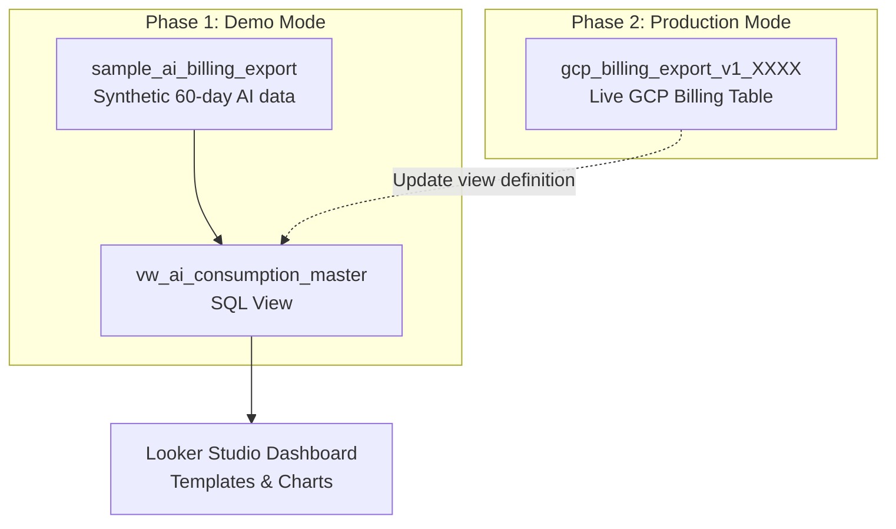

# Guide: Deploying with Dummy Data & Switching to Production Billing Export

This guide walks you through:
1. **Part 1**: Deploying the AI Consumption Dashboard with realistic **dummy (sample) data** to test and explore the dashboard immediately.
2. **Part 2**: Switching the dashboard's data source to your live **Google Cloud Billing Export** when ready—**with zero downtime and without modifying your Looker Studio report**.

---

## Architecture: Why Switching is Seamless

Looker Studio connects to a curated BigQuery view: **`vw_ai_consumption_master`**, never directly to the raw tables.



Because Looker Studio reads from the **view**, your dashboard charts, fields, metrics, and URLs remain completely intact when you transition from dummy data to production. You only update the underlying view definition in BigQuery.

---

## Part 1: Deploy with Dummy Data

Follow these steps if you do not yet have Cloud Billing Export enabled, or if you want to test the Looker Studio template in a sandbox or demo environment.

### 1.1 Prerequisites
- Google Cloud project with BigQuery enabled.
- Cloud Shell or a local terminal with `gcloud` and `bq` installed.

### 1.2 Run the Automated Deployment Script
Clone or navigate to the repository directory in Cloud Shell:

```bash
cd ~/gcp-consumption-dashbord
chmod +x deploy_ai_dashboard.sh
./deploy_ai_dashboard.sh
```

### 1.3 Answer the Prompts for Demo Mode

| Prompt | Input | Description |
| :--- | :--- | :--- |
| `Enter your Argolis Project ID` | Press **Enter** | Uses your active `gcloud` project. |
| `Enter BigQuery Dataset ID` | Press **Enter** | Uses the default: `ai_billing_dashboard`. |
| `Enter BigQuery Dataset Location` | Press **Enter** | Uses the default: `US` (or type your region, e.g. `EU`). |
| `Select option [1 or 2]` | **`2`** | Selects **Demo mode**. |

### 1.4 What Gets Created
The script automatically provisions:
1. **Dataset**: `ai_billing_dashboard` (in your chosen location).
2. **Table** `sample_ai_billing_export`: Generates 60 days of synthetic billing line items with realistic prices, usage units, and discounts for:
   - **Generative AI**: Gemini 1.5 Pro/Flash, Gemini 2.0 Flash, Claude 3.5 Sonnet, Imagen 3, Embeddings.
   - **AI Compute**: NVIDIA A100 (80GB), H100, L4 GPUs, and Cloud TPU v5e pod slices.
   - **Perception & Agentic AI**: Document AI, Dialogflow CX, Discovery Engine / Vertex Search.
   - **Cost Allocation Labels**: Sample `team`, `environment` (`prod`, `staging`, `dev`), `cost_center`, and `app` labels.
3. **Master View**: `vw_ai_consumption_master` (normalizes credits, calculates net cost, extracts model families, and categorizes AI spend).
4. **Alerts View**: `vw_ai_cost_anomaly_alerts` (detects daily spending spikes >1.8× above the 7-day rolling average).

### 1.5 Verify the Dummy Data
Run a test query in Cloud Shell to verify the data:

```bash
bq query --use_legacy_sql=false "
SELECT
  ai_category,
  model_or_resource_family,
  ROUND(SUM(gross_cost), 2) AS gross_cost_usd,
  ROUND(SUM(total_credits), 2) AS credits_usd,
  ROUND(SUM(net_cost), 2) AS net_cost_usd
FROM \`ai_billing_dashboard.vw_ai_consumption_master\`
GROUP BY 1, 2
ORDER BY net_cost_usd DESC;"
```

### 1.6 Launch Looker Studio Dashboard
Run the Python helper to generate your custom Looker Studio linking URL:

```bash
python3 create_looker_studio_dashboard.py <YOUR_PROJECT_ID> ai_billing_dashboard vw_ai_consumption_master
```

1. Copy the printed URL and paste it into your browser.
2. Looker Studio opens with the pre-built dashboard template automatically connected to your `vw_ai_consumption_master` view.
3. Click **Save and share** (top right) to save a personal copy into your Google account.

---

## Part 2: Switching to Production Billing Export

When your production Cloud Billing export is ready, switch the data source using either **Method A** (easiest, interactive) or **Method B** (SQL command).

### 2.1 Production Prerequisites Checklist

Before switching:
1. **Locate your production billing export table**:
   In BigQuery console or via CLI, find your table:
   ```bash
   bq ls --project_id=<BILLING_PROJECT_ID>
   bq ls <BILLING_PROJECT_ID>:<BILLING_DATASET_ID>
   ```
   Note the full path: `<BILLING_PROJECT_ID>.<BILLING_DATASET_ID>.gcp_billing_export_v1_XXXXXX` (Standard) or `...gcp_billing_export_resource_v1_XXXXXX` (Detailed).

2. **Check the location**:
   ```bash
   bq show --format=prettyjson <BILLING_PROJECT_ID>:<BILLING_DATASET_ID> | grep location
   ```
   > [!IMPORTANT]
   > Your `ai_billing_dashboard` dataset **must be in the same location** (e.g. `US` or `EU`) as your billing export dataset. BigQuery views cannot query tables across different locations.

3. **Verify IAM permissions**:
   Ensure you have:
   - `roles/bigquery.dataViewer` on the billing export dataset.
   - `roles/bigquery.dataEditor` on the `ai_billing_dashboard` dataset.

---

### 2.2 Method A: Re-run the Interactive Deployment Script (Recommended)

The simplest way to switch is to re-run `deploy_ai_dashboard.sh`:

```bash
./deploy_ai_dashboard.sh
```

Answer the prompts as follows:

| Prompt | Input |
| :--- | :--- |
| `Enter your Argolis Project ID` | Your target project ID where views reside. |
| `Enter BigQuery Dataset ID` | `ai_billing_dashboard` (or your existing dataset). |
| `Enter BigQuery Dataset Location` | Same location as your billing export (e.g. `US`). |
| `Select option [1 or 2]` | **`1`** (Production mode) |
| `Enter full path to Billing Export table` | `<BILLING_PROJECT_ID>.<BILLING_DATASET_ID>.gcp_billing_export_v1_XXXXXX` |

The script executes `CREATE OR REPLACE VIEW` on both views to point them to your live billing export table.

---

### 2.3 Method B: Update the View Directly via SQL

If you prefer to execute the update in the BigQuery Web Console or via `bq query`, run the following query. Replace the placeholders with your project, dataset, and live billing export table:

```sql
CREATE OR REPLACE VIEW `<YOUR_PROJECT_ID>.ai_billing_dashboard.vw_ai_consumption_master` AS
WITH raw_billing AS (
  SELECT
    billing_account_id,
    DATE(usage_start_time) AS usage_date,
    invoice.month AS invoice_month,
    project.id AS project_id,
    project.name AS project_name,
    location.region AS region,
    service.id AS service_id,
    service.description AS service_name,
    sku.id AS sku_id,
    sku.description AS sku_description,
    usage.amount AS usage_amount,
    usage.unit AS usage_unit,
    cost AS gross_cost,
    COALESCE((SELECT SUM(c.amount) FROM UNNEST(credits) c), 0) AS total_credits,
    GREATEST(0.0, cost + COALESCE((SELECT SUM(c.amount) FROM UNNEST(credits) c), 0)) AS net_cost,
    currency,
    -- Extract organizational metadata from labels
    (SELECT value FROM UNNEST(labels) WHERE key = 'environment') AS label_env,
    (SELECT value FROM UNNEST(labels) WHERE key = 'cost_center') AS label_cost_center,
    (SELECT value FROM UNNEST(labels) WHERE key = 'team') AS label_team,
    (SELECT value FROM UNNEST(labels) WHERE key = 'app') AS label_app
  FROM
    `<BILLING_PROJECT_ID>.<BILLING_DATASET_ID>.gcp_billing_export_v1_XXXXXX`  -- <-- REPLACE WITH YOUR BILLING EXPORT TABLE
  WHERE
    DATE(usage_start_time) >= DATE_SUB(CURRENT_DATE(), INTERVAL 365 DAY)
    AND (
      service.description IN (
        'Vertex AI',
        'Generative AI Support',
        'Cloud Vision API',
        'Cloud Natural Language API',
        'Cloud Translation API',
        'Cloud Speech-to-Text API',
        'Cloud Text-to-Speech API',
        'Document AI',
        'Dialogflow Enterprise Edition',
        'Dialogflow CX',
        'Discovery Engine'
      )
      OR (
        service.description = 'Compute Engine'
        AND REGEXP_CONTAINS(sku.description, r'(?i)Nvidia|A100|H100|V100|L4|T4|P100|TPU|Tensor')
      )
    )
)
SELECT
  *,
  CASE
    WHEN REGEXP_CONTAINS(sku_description, r'(?i)Gemini|Claude|PaLM|Imagen|Codey|Embeddings|Text Generation|Multimodal|Provisioned Throughput') THEN 'Generative AI'
    WHEN service_name IN ('Dialogflow Enterprise Edition', 'Dialogflow CX', 'Discovery Engine') THEN 'Agentic & Conversational AI'
    WHEN REGEXP_CONTAINS(sku_description, r'(?i)Nvidia|A100|H100|V100|L4|T4|P100|TPU') THEN 'AI Compute (GPU/TPU)'
    ELSE 'Perception & Cognitive AI'
  END AS ai_category,

  CASE
    WHEN REGEXP_CONTAINS(sku_description, r'(?i)Gemini.*1\.5.*Pro') THEN 'Gemini 1.5 Pro'
    WHEN REGEXP_CONTAINS(sku_description, r'(?i)Gemini.*1\.5.*Flash') THEN 'Gemini 1.5 Flash'
    WHEN REGEXP_CONTAINS(sku_description, r'(?i)Gemini.*2\.0') THEN 'Gemini 2.0'
    WHEN REGEXP_CONTAINS(sku_description, r'(?i)Claude') THEN 'Anthropic Claude'
    WHEN REGEXP_CONTAINS(sku_description, r'(?i)Imagen') THEN 'Imagen'
    WHEN REGEXP_CONTAINS(sku_description, r'(?i)Embedding') THEN 'Embeddings'
    WHEN REGEXP_CONTAINS(sku_description, r'(?i)Provisioned Throughput') THEN 'Provisioned Throughput'
    WHEN REGEXP_CONTAINS(sku_description, r'(?i)A100') THEN 'NVIDIA A100 GPU'
    WHEN REGEXP_CONTAINS(sku_description, r'(?i)H100') THEN 'NVIDIA H100 GPU'
    WHEN REGEXP_CONTAINS(sku_description, r'(?i)L4') THEN 'NVIDIA L4 GPU'
    WHEN REGEXP_CONTAINS(sku_description, r'(?i)TPU') THEN 'Google Cloud TPU'
    ELSE service_name
  END AS model_or_resource_family,

  CASE
    WHEN REGEXP_CONTAINS(sku_description, r'(?i)Input|Prompt') THEN 'Input (Prompt)'
    WHEN REGEXP_CONTAINS(sku_description, r'(?i)Output|Candidate') THEN 'Output (Response)'
    WHEN REGEXP_CONTAINS(sku_description, r'(?i)Context Caching') THEN 'Context Cache'
    ELSE 'API Request / Hourly'
  END AS modality_type
FROM raw_billing;
```

---

### 2.4 (Optional) Delete the Dummy Table

Once your views point to production, the `sample_ai_billing_export` dummy table is no longer referenced. You can delete it to avoid clutter:

```bash
bq rm -f -t <YOUR_PROJECT_ID>:ai_billing_dashboard.sample_ai_billing_export
```

---

## Part 3: Refresh Your Looker Studio Dashboard

1. Open your Looker Studio report.
2. In the top-right toolbar, click the **Refresh data** icon (circular arrow), or press `Ctrl + Shift + R` (`Cmd + Shift + R` on Mac).
3. The dashboard immediately updates to display your live production AI billing figures! No chart re-mapping or configuration changes required.

---

## Troubleshooting Common Issues During Switch

| Issue | Cause | Solution |
| :--- | :--- | :--- |
| `Not found: Dataset ... was not found in location` | The `ai_billing_dashboard` dataset and the billing export dataset are in different multi-regions or regions. | Re-create `ai_billing_dashboard` in the same region as the billing export (`bq --location=<LOC> mk --dataset ...`). |
| `Access Denied: Table ... Permission bigquery.tables.getData denied` | The user viewing or executing the query lacks permissions on the billing export dataset. | Grant `roles/bigquery.dataViewer` to the user, or set up the view as an [Authorized View](https://cloud.google.com/bigquery/docs/authorized-views). |
| Net cost shows `0` or negative | Incorrect calculation of credits. | The view already handles this via `GREATEST(0.0, cost + total_credits)` where credits are recorded as negative values. |
| Custom labels not appearing | Your organization uses different label keys than `environment`, `team`, `cost_center`, `app`. | In the view definition under `-- Extract organizational metadata`, update the label keys to match your company's naming standards. |
