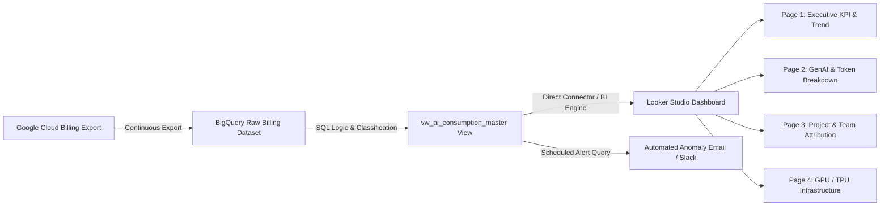

# Step-by-Step Implementation Guide: Google Cloud AI Consumption & Cost Dashboard

This guide provides an end-to-end walkthrough for deploying a production-ready **AI Consumption & Cost Monitoring Dashboard** using **Google Cloud Billing Export to BigQuery** and **Looker Studio** (or Looker / Tableau).

---

## 1. Architecture Overview



---

## 2. Prerequisites & Access Checklist

Before starting, ensure the team has the following access and assets:

| Requirement | Description | Minimum IAM Role / Permission |
| :--- | :--- | :--- |
| **Cloud Billing Export** | Standard or Detailed Billing Export enabled to BigQuery | `Billing Account Costs Manager` or `Billing Account Viewer` |
| **BigQuery Dataset** | Destination project where billing tables reside | `roles/bigquery.admin` or `roles/bigquery.dataEditor` |
| **Looker Studio** | Access to [lookerstudio.google.com](https://lookerstudio.google.com) | Account with BigQuery Read access (`roles/bigquery.user` + `roles/bigquery.dataViewer`) |

---

## 3. Step 1: Locate & Verify Billing Table

1. Open the [BigQuery Console](https://console.cloud.google.com/bigquery).
2. In the Explorer pane, locate your billing export dataset.
3. Identify your table name format:
   - **Standard Export**: `gcp_billing_export_v1_XXXXXX_XXXXXX_XXXXXX`
   - **Detailed Export**: `gcp_billing_export_resource_v1_XXXXXX_XXXXXX_XXXXXX`
4. Run this quick sanity query to confirm AI spend exists in the dataset:

```sql
SELECT
  service.description AS service_name,
  COUNT(1) AS row_count,
  ROUND(SUM(cost), 2) AS total_cost
FROM
  `YOUR_PROJECT_ID.YOUR_DATASET_ID.gcp_billing_export_v1_XXXXXX_XXXXXX_XXXXXX`
WHERE
  _PARTITIONDATE >= DATE_SUB(CURRENT_DATE(), INTERVAL 30 DAY)
  AND (
    service.description IN ('Vertex AI', 'Cloud Translation API', 'Cloud Vision API', 'Document AI', 'Discovery Engine')
    OR (service.description = 'Compute Engine' AND REGEXP_CONTAINS(sku.description, r'(?i)Nvidia|A100|H100|L4|T4|TPU'))
  )
GROUP BY 1
ORDER BY total_cost DESC;
```

---

## 4. Step 2: Deploy the BigQuery Master View

Create the unified SQL view `vw_ai_consumption_master`. This view:
- Categorizes services into **Generative AI**, **Agentic & Conversational AI**, **AI Compute (GPUs/TPUs)**, and **Perception AI**.
- Parses model families (Gemini 1.5 Flash/Pro, Gemini 2.0, Claude on Vertex, Imagen, Embeddings).
- Computes **Net Cost** by incorporating promotional credits, committed use discounts (CUDs), and free tier.
- Unnests custom resource/project labels (`team`, `environment`, `cost_center`, `app`).

> [!IMPORTANT]
> In the script below, replace `YOUR_PROJECT_ID.YOUR_DATASET_ID.gcp_billing_export_v1_XXXXXX_XXXXXX_XXXXXX` with your actual BigQuery table.

```sql
CREATE OR REPLACE VIEW `YOUR_PROJECT_ID.YOUR_DATASET_ID.vw_ai_consumption_master` AS
WITH raw_billing AS (
  SELECT
    billing_account_id,
    DATE(usage_start_time) AS usage_date,
    invoice.month AS invoice_month,
    project.id AS project_id,
    project.name AS project_name,
    location.region AS region,
    service.id AS service_id,
    service.description AS service_name,
    sku.id AS sku_id,
    sku.description AS sku_description,
    usage.amount AS usage_amount,
    usage.unit AS usage_unit,
    cost AS gross_cost,
    COALESCE((SELECT SUM(c.amount) FROM UNNEST(credits) c), 0) AS total_credits,
    GREATEST(0.0, cost + COALESCE((SELECT SUM(c.amount) FROM UNNEST(credits) c), 0)) AS net_cost,
    currency,
    -- Extract organizational metadata from labels (customize label keys if different)
    (SELECT value FROM UNNEST(labels) WHERE key = 'environment') AS label_env,
    (SELECT value FROM UNNEST(labels) WHERE key = 'cost_center') AS label_cost_center,
    (SELECT value FROM UNNEST(labels) WHERE key = 'team') AS label_team,
    (SELECT value FROM UNNEST(labels) WHERE key = 'app') AS label_app
  FROM
    `YOUR_PROJECT_ID.YOUR_DATASET_ID.gcp_billing_export_v1_XXXXXX_XXXXXX_XXXXXX`
  WHERE
    _PARTITIONDATE >= DATE_SUB(CURRENT_DATE(), INTERVAL 365 DAY)
    AND (
      service.description IN (
        'Vertex AI',
        'Generative AI Support',
        'Cloud Vision API',
        'Cloud Natural Language API',
        'Cloud Translation API',
        'Cloud Speech-to-Text API',
        'Cloud Text-to-Speech API',
        'Document AI',
        'Dialogflow Enterprise Edition',
        'Dialogflow CX',
        'Discovery Engine'
      )
      OR (
        service.description = 'Compute Engine'
        AND REGEXP_CONTAINS(sku.description, r'(?i)Nvidia|A100|H100|V100|L4|T4|P100|TPU|Tensor')
      )
    )
)
SELECT
  *,
  -- Classification into AI Tier
  CASE
    WHEN REGEXP_CONTAINS(sku_description, r'(?i)Gemini|Claude|PaLM|Imagen|Codey|Embeddings|Text Generation|Multimodal|Provisioned Throughput') THEN 'Generative AI'
    WHEN service_name IN ('Dialogflow Enterprise Edition', 'Dialogflow CX', 'Discovery Engine') THEN 'Agentic & Conversational AI'
    WHEN REGEXP_CONTAINS(sku_description, r'(?i)Nvidia|A100|H100|V100|L4|T4|P100|TPU') THEN 'AI Compute (GPU/TPU)'
    ELSE 'Perception & Cognitive AI'
  END AS ai_category,

  -- Model & Architecture Breakdown
  CASE
    WHEN REGEXP_CONTAINS(sku_description, r'(?i)Gemini.*1\.5.*Pro') THEN 'Gemini 1.5 Pro'
    WHEN REGEXP_CONTAINS(sku_description, r'(?i)Gemini.*1\.5.*Flash') THEN 'Gemini 1.5 Flash'
    WHEN REGEXP_CONTAINS(sku_description, r'(?i)Gemini.*2\.0') THEN 'Gemini 2.0'
    WHEN REGEXP_CONTAINS(sku_description, r'(?i)Claude') THEN 'Anthropic Claude'
    WHEN REGEXP_CONTAINS(sku_description, r'(?i)Imagen') THEN 'Imagen'
    WHEN REGEXP_CONTAINS(sku_description, r'(?i)Embedding') THEN 'Embeddings'
    WHEN REGEXP_CONTAINS(sku_description, r'(?i)Provisioned Throughput') THEN 'Provisioned Throughput'
    WHEN REGEXP_CONTAINS(sku_description, r'(?i)A100') THEN 'NVIDIA A100 GPU'
    WHEN REGEXP_CONTAINS(sku_description, r'(?i)H100') THEN 'NVIDIA H100 GPU'
    WHEN REGEXP_CONTAINS(sku_description, r'(?i)L4') THEN 'NVIDIA L4 GPU'
    WHEN REGEXP_CONTAINS(sku_description, r'(?i)TPU') THEN 'Google Cloud TPU'
    ELSE service_name
  END AS model_or_resource_family,

  -- Token / Request Modality
  CASE
    WHEN REGEXP_CONTAINS(sku_description, r'(?i)Input|Prompt') THEN 'Input (Prompt)'
    WHEN REGEXP_CONTAINS(sku_description, r'(?i)Output|Candidate') THEN 'Output (Response)'
    WHEN REGEXP_CONTAINS(sku_description, r'(?i)Context Caching') THEN 'Context Cache'
    ELSE 'API Request / Hourly'
  END AS modality_type
FROM raw_billing;
```

---

## 5. Step 3: Build the Looker Studio Dashboard

### A. Connect the Data Source
1. Navigate to [Looker Studio](https://lookerstudio.google.com).
2. Click **Create** > **Data Source**.
3. Select the **BigQuery** connector.
4. Select your **Billing Project** > **Billing Dataset** > **`vw_ai_consumption_master`**.
5. Ensure `usage_date` is marked as **Date** (YYYYMMDD) and `net_cost` is marked as **Currency (USD)**.
6. Click **Create Report**.

---

### B. Global Filter Bar (Top Header)
Add the following controls across the top of every dashboard page:
- **Date Range Control**: Set default to `Last 30 Days` (Include Today or Exclude Today).
- **Drop-down list (AI Category)**: Dimension = `ai_category`.
- **Drop-down list (Project Name)**: Dimension = `project_name`.
- **Drop-down list (Environment)**: Dimension = `label_env`.
- **Drop-down list (Team)**: Dimension = `label_team`.

---

### C. Page 1: Executive KPI & Consumption Trends

| Widget Type | Title | Dimension | Metric | Comparison / Style |
| :--- | :--- | :--- | :--- | :--- |
| **Scorecard** | Total AI Net Spend | — | `SUM(net_cost)` | Compare to Previous Period (%) |
| **Scorecard** | Total Gross Spend | — | `SUM(gross_cost)` | Currency format |
| **Scorecard** | Total Discounts/Credits | — | `SUM(total_credits)` | Negative value (savings) |
| **Scorecard** | GenAI Share % | — | Calculated Field: `SUM(CASE WHEN ai_category = 'Generative AI' THEN net_cost ELSE 0 END) / SUM(net_cost)` | Percentage format |
| **Time Series (Stacked Area)** | Daily Spend by Category | `usage_date`, Breakdown: `ai_category` | `SUM(net_cost)` | Smooth lines, show data points |
| **Donut Chart** | Spend by AI Category | `ai_category` | `SUM(net_cost)` | Data labels as value & percentage |

---

### D. Page 2: Generative AI & Token Deep-Dive

Filter this page to `ai_category = 'Generative AI'` using page-level filters.

| Widget Type | Title | Dimension(s) | Metric(s) | Notes |
| :--- | :--- | :--- | :--- | :--- |
| **Bar Chart** | Top Models by Spend | `model_or_resource_family` | `SUM(net_cost)` | Horizontal bars, sorted descending |
| **Pivot Table** | Token Breakdown by Model | Row: `model_or_resource_family`<br>Column: `modality_type` | 1. `SUM(usage_amount)` (Tokens)<br>2. `SUM(net_cost)` ($) | Shows prompt vs response cost ratio |
| **Detailed Table** | GenAI SKU Level Analysis | `model_or_resource_family`, `sku_description`, `usage_unit` | 1. `SUM(usage_amount)`<br>2. `SUM(net_cost)` | Heatmap metric formatting for spend |

---

### E. Page 3: Project, Team & Cost Center Attribution

| Widget Type | Title | Dimension(s) | Metric(s) | Notes |
| :--- | :--- | :--- | :--- | :--- |
| **Treemap** | AI Spend by Project & Team | Dimension 1: `label_team`<br>Dimension 2: `project_name` | `SUM(net_cost)` | Color gradient by spend intensity |
| **Table with Bars** | Cost Center Breakdown | `label_cost_center`, `label_env` | `SUM(net_cost)`, `% of Total` | Easy export to CSV for finance |
| **Bar Chart** | Top 10 Consuming Projects | `project_name` | `SUM(net_cost)` | Sort Descending (Top 10) |

---

### F. Page 4: AI Compute Infrastructure (GPUs & TPUs)

Filter this page to `ai_category = 'AI Compute (GPU/TPU)'`.

| Widget Type | Title | Dimension(s) | Metric(s) | Notes |
| :--- | :--- | :--- | :--- | :--- |
| **Scorecard** | Total Accelerator Hours | — | `SUM(usage_amount)` | Units: Hours |
| **Donut Chart** | Spend by Accelerator Type | `model_or_resource_family` | `SUM(net_cost)` | A100 vs H100 vs L4 vs TPU |
| **Table** | GPU/TPU Usage by Region & Project | `project_name`, `region`, `sku_description` | 1. `SUM(usage_amount)` (Hours)<br>2. `SUM(net_cost)` ($) | Identifies idle or high-cost regional deployments |

---

## 6. Step 4: Configure Automated Anomaly Alerts

To catch unintended runaways or sudden surges in LLM token usage, set up a daily scheduled alert query in BigQuery or BigQuery Scheduled Queries to notify your team.

```sql
WITH daily_project_spend AS (
  SELECT
    usage_date,
    project_id,
    project_name,
    ai_category,
    SUM(net_cost) AS daily_net_cost
  FROM
    `YOUR_PROJECT_ID.YOUR_DATASET_ID.vw_ai_consumption_master`
  WHERE
    usage_date >= DATE_SUB(CURRENT_DATE(), INTERVAL 30 DAY)
  GROUP BY 1, 2, 3, 4
),
rolling_stats AS (
  SELECT
    *,
    AVG(daily_net_cost) OVER(
      PARTITION BY project_id, ai_category
      ORDER BY usage_date
      ROWS BETWEEN 7 PRECEDING AND 1 PRECEDING
    ) AS prev_7d_avg_cost
  FROM daily_project_spend
)
SELECT
  usage_date,
  project_id,
  project_name,
  ai_category,
  ROUND(daily_net_cost, 2) AS today_spend_usd,
  ROUND(prev_7d_avg_cost, 2) AS baseline_avg_usd,
  ROUND(daily_net_cost - prev_7d_avg_cost, 2) AS surge_amount_usd,
  ROUND(SAFE_DIVIDE(daily_net_cost, prev_7d_avg_cost), 2) AS surge_multiple
FROM
  rolling_stats
WHERE
  usage_date = DATE_SUB(CURRENT_DATE(), INTERVAL 1 DAY)
  AND daily_net_cost > 100.0 -- Threshold: spend > $100
  AND daily_net_cost > (prev_7d_avg_cost * 2.0) -- Surge: 2x above baseline
ORDER BY surge_amount_usd DESC;
```

---

## 7. Operational Best Practices & Governance

> [!TIP]
> **Enable BigQuery BI Engine**: In BigQuery > BI Engine reservations, allocate 1-2 GB of memory in your dataset's region to accelerate Looker Studio dashboard queries to sub-second speeds at no extra query charge.

1. **Tagging & Labeling Standard**:
   Enforce project and resource-level tags (`environment: prod/stage/dev`, `team: analytics/nlp/cx`, `cost_center: 1234`). The master view will automatically pick these up.
2. **Context Caching & Model Tuning Optimization**:
   Monitor the `modality_type = 'Context Cache'` metric on Page 2. Gemini Context Caching can reduce input token costs by up to 75% on repetitive prompts.
3. **Partition Guard**:
   Always keep the `_PARTITIONDATE >= DATE_SUB(CURRENT_DATE(), INTERVAL X DAY)` clause intact in all custom queries to avoid full table scan charges.
